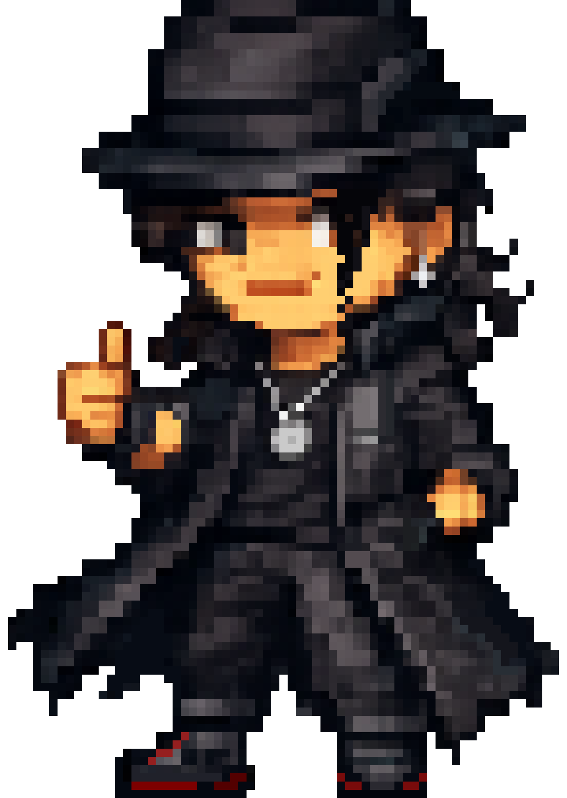
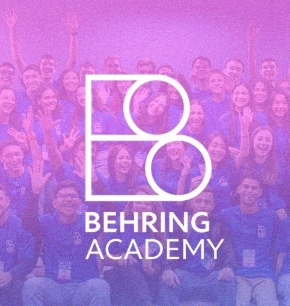

<h2 align="center">Olá, meu nome é Gabriel Flaulhabe 👋</h2>

<table border="0">
<tr>
<td>
  
Sou estudante do IFSULDEMINAS — Campus Avançado Carmo de Minas, no Ensino Médio integrado ao Técnico em Informática, e um desenvolvedor em formação com interesse em programação, arquitetura de software e inteligência artificial.

Minha história com tecnologia começou pela curiosidade. Desde 2019 participo de olimpíadas científicas, principalmente nas áreas de astronomia, matemática, programação, robótica, e outras. Experiências que me ensinaram a enfrentar problemas sem uma resposta pronta, testar ideias e aprender com os erros.

Com o tempo, esse interesse saiu dos desafios de competição e virou prática em projetos reais: aplicações com banco de dados, autenticação, IA generativa e desenvolvimento mobile. Gosto de entender não apenas como fazer um sistema funcionar, mas também como organizá-lo para que continue evoluindo.

Atualmente, busco aprofundar meus conhecimentos em engenharia de software e inteligência artificial, com o objetivo de cursar Ciência da Computação na UNIFEI e continuar construindo projetos que resolvam problemas reais.

</td>
<td width="290">

 $\textsf{\color{#d41212}{ouvindo agora:}}$

  

</td>
</tr>
</table>

## 🏛️ Behring Academy

Faço parte da **[Behring Academy](https://behring.academy/)**, uma jornada de formação em tecnologia da **Fundação Behring** voltada para jovens interessados em construir uma carreira na área.

O programa me acompanha durante o Ensino Médio com uma formação complementar em **programação, matemática, inglês e desenvolvimento socioemocional**, além de mentorias, projetos práticos e uma comunidade de estudantes de diferentes regiões do Brasil.

Em 2025, fui um dos **42 estudantes selecionados entre 1.775 inscritos** de todo o Brasil. Essa experiência tem sido uma oportunidade para evoluir tecnicamente, conhecer pessoas com interesses semelhantes e continuar construindo meu caminho na tecnologia.

 

## 🏆 Trajetória em Olimpíadas Científicas

| Competição                                                           | Conquistas           |
| -------------------------------------------------------------------- | -------------------- |
| 🌌 OBA — Olimpíada Brasileira de Astronomia e Astronáutica           | 🥇🥇🥈🥇🥇        |
| 💻 OBI — Olimpíada Brasileira de Informática                         | 🏅🥉                |
| ➗ OBMEP — Olimpíada Brasileira de Matemática das Escolas Públicas   | 🥇🥈🥉🏅🏅🏅      |
| 🚀 MOBFOG — Mostra Brasileira de Foguetes                            | 🥇🥇🥉             |
| 🤖 OBR — Olimpíada Brasileira de Robótica                            | 🥈🥉🏅🏅           |
| 🔬 ONC — Olimpíada Nacional de Ciências                              | 🥈🥈🏅🏅           |
| 🧬 ONANO — Olimpíada Nacional de Nanotecnologia                      | 🥈🥇                |
| 🧠 OBICT — Olimpíada Brasileira de Iniciação Científica e Tecnologia | 🥈                  |
| 🧩 OLIP — Olimpíada Interna de Programação                           | 🥈                  |
| 🌊 O2 — Olimpíada Brasileira do Oceano                               | 🥇                  |
| 🔭 IPhCO — Olimpíada Internacional de Física e Cultura               | 🥇                  |
| 💻 OBOI — Olimpíada Brasileira Online de Informática                 | 🥉                  |
| 📐 Outras olimpíadas                                                 | 🥇🥇🥈🥈🥈🥈🥉🥉🥉🥉 |

 

## 🗂️ Projetos em destaque

### 🍔 iChat — Plataforma de Gestão para Restaurantes (Hackathon iFood)

Projeto full-stack desenvolvido para um hackathon do iFood, criando uma plataforma de gestão para restaurantes com pedidos, cardápio, faturamento e previsão de demanda.

- **Arquitetura:** API REST em **Flask** com autenticação **JWT**, organizada por módulos (`auth`, `menu_items`, `orders`, `analytics`) e documentação automática via **Spectree**. Frontend em HTML/CSS/JS com **Vue 3** e **Axios**.
- **IA e dados:** notebooks em **Jupyter** exploram previsão de demanda e tempo de entrega usando dados históricos de pedidos.
- **Desafio técnico:** unificar dados históricos via CSV e pedidos em tempo real no mesmo modelo (`TrainRecord`), permitindo que dashboards e filtros funcionem sem diferenciar a origem dos dados.
`Flask` `Flask-SQLAlchemy` `JWT` `Spectree` `SQLite` `Vue 3` `Axios` `Jupyter`

---

### 🩺 Anamnese IA — Pré-Consulta Homeopática Inteligente

Sistema em produção para consultório médico, utilizando IA generativa para conduzir uma anamnese conversacional antes da consulta.

- **Arquitetura:** roteiro clínico configurável em um único arquivo, com perguntas geradas pelo **Google Gemini**, validação das respostas e extração de dados estruturados para relatórios médicos.
- **Funcionalidades:** geração de relatórios para paciente e médico, exportação em **PDF** e painel administrativo com controle de usuários e consumo da API de IA.
- **Desafio técnico:** reduzir alucinações do modelo separando dados originais do paciente e dados processados pela IA, evitando inferências não autorizadas.

`PHP 8` `MySQL` `PDO` `Google Gemini API` `Dompdf` `Composer`

---

### 📍 GeoWake — Despertador Inteligente por Localização

Aplicativo mobile publicado comercialmente, desenvolvido em equipe.

- **Problema:** substituir alarmes baseados em horário por alertas baseados em localização, evitando perder destinos durante trajetos.
- **Arquitetura:** aplicação Flutter organizada por domínio, separando lógica de alarmes, mapas e internacionalização.
- **Desafio técnico:** calcular proximidade do destino usando **Google Maps** e **Directions API**, mantendo notificações confiáveis em segundo plano e suporte a múltiplos alarmes.

`Flutter` `Dart` `Google Maps API` `Google Directions API` `Notificações nativas` `l10n`

## 🛠️ Stack

**Linguagens**

**Backend**

-777BB4?style=for-the-badge&logo=php&logoColor=white)

**Mobile**

**Banco de Dados**

**Inteligência Artificial**

**Ferramentas & APIs**

 

## 📊 GitHub

 

 

<picture>
  <source media="(prefers-color-scheme: dark)" srcset="https://raw.githubusercontent.com/GabrielFlau132/GabrielFlau132/output/snake-dark.svg">
  <source media="(prefers-color-scheme: light)" srcset="https://raw.githubusercontent.com/GabrielFlau132/GabrielFlau132/output/snake.svg">
  
</picture>

 

 

## 🎯 Objetivos

- Ingressar em Ciência da Computação
- Aprofundar arquitetura de sistemas escaláveis e boas práticas de engenharia de software
- Seguir explorando aplicações práticas de inteligência artificial, com foco em sistemas confiáveis e não apenas em provas de conceito
- Continuar na rede de mentoria da Fundação Behring rumo às melhores oportunidades acadêmicas em tecnologia

 

## 📫 Contato

